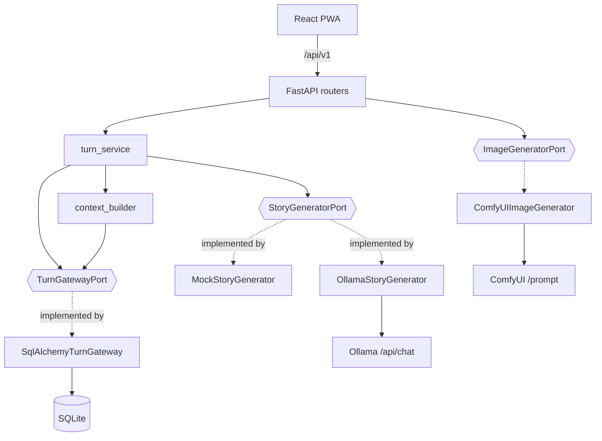
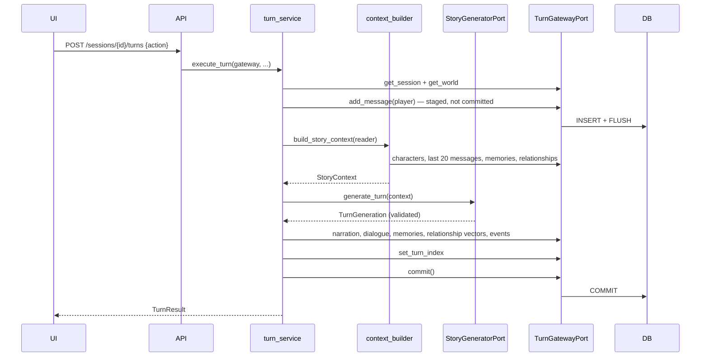

# Architecture

A pragmatic modular monolith. The layering resembles ports-and-adapters, but only where
that boundary earns its keep: external AI systems and the database.

## Modules

```text
apps/api/app/
├── domain/           pure Python: enums, relationship rules, errors. No I/O, no ORM.
│   └── world_rules/      WorldRulesV1, its enums, presets, versioned parsing
├── application/      use cases, the AI contract, ports. Depends on domain only.
│   ├── contracts.py      TurnGeneration and friends — what a model may return
│   ├── story_context.py  StoryContext — what a model is allowed to see
│   ├── ports.py          StoryGeneratorPort, ImageGeneratorPort (Protocols)
│   ├── persistence.py    read/write DTOs + the persistence ports
│   ├── context_builder.py  all retrieval policy, in one place
│   ├── rules_projection.py WorldRules → the compact AI-facing view
│   └── turn_service.py   the turn use case
├── infrastructure/   adapters: SQLAlchemy models, Ollama, ComfyUI, prompt loading
│   └── db/turn_gateway.py  SQLAlchemy implementation of the persistence ports
├── api/              HTTP adapter and composition: routers, DTOs, errors, DI
├── prompts/          version-controlled prompt files
└── scripts/          seed_demo
```

Dependencies point inwards: `api → application → domain`. `infrastructure` implements
the ports that `application` declares, and `api` is the HTTP adapter that composes the
two. Nothing in `domain` or `application` imports SQLAlchemy, FastAPI, `httpx`,
`app.infrastructure` or `app.api`; `domain` additionally does not import `application`.

That rule is **enforced, not just stated**. `tests/test_architecture.py` walks the AST of
every module under `app/domain` and `app/application` and fails on a forbidden import.
It exists because the rule was documented here while the turn service and context
builder were importing `sqlalchemy` and the ORM models directly — prose cannot fail a
build.



## Request lifecycle

1. FastAPI resolves `DbSession` — a request-scoped `AsyncSession`. For the turn
   endpoint it resolves `TurnGateway` instead, which binds `SqlAlchemyTurnGateway` to
   that same session. This is the only place the turn use case and the ORM meet.
2. The router validates the request into a DTO.
3. The router or an application service does the work.
4. **Write endpoints commit explicitly**, inside the handler or the use case.
5. The response is serialised from a DTO. ORM objects never cross the boundary.
6. Domain errors are mapped to a consistent envelope by `api/errors.py`.

Simple CRUD routers still query SQLAlchemy directly. That is deliberate: inventing a
repository per table to move `SELECT * FROM worlds` behind an interface would add
indirection without removing a dependency the API layer is allowed to have. Ports exist
where there is a use case to protect — currently the turn loop.

### Why commits are explicit

FastAPI closes `yield` dependencies *after* the response has been sent. Committing in
that teardown means a client which immediately re-reads can miss its own write — the
frontend refetches the transcript right after a turn, so this was a real race, not a
theoretical one. `get_db` therefore never commits; it only guarantees rollback on
failure. This is pinned by `test_turn_is_visible_to_an_immediate_reread`.

## Turn lifecycle



### Transaction strategy

**A turn is atomic.** Everything — including the player's own message — is written in
one transaction that commits only after the provider returns a valid `TurnGeneration`.

If generation fails, the whole transaction rolls back. The alternative (committing the
player message first) leaves a transcript ending in an unanswered action and a turn
counter that disagrees with the messages. A failed turn is a **no-op the player can
simply retry**, which is exactly what the UI tells them. Covered by
`test_failed_generation_rolls_back_the_entire_turn`.

The player's action is *staged* before generation — written and flushed, never
committed — so it appears in the transcript the provider reads. `TurnPersistencePort`
documents that requirement; the adapter satisfies it with a flush, and
`test_a_staged_message_is_readable_before_commit` pins both halves.

## Persistence ports

The turn use case reaches storage through three Protocols in
`application/persistence.py`:

| Port | Responsibility |
|---|---|
| `StoryContextReaderPort` | the reads that feed context assembly |
| `TurnPersistencePort` | session/world lookups and every turn write |
| `TurnUnitOfWorkPort` | `commit()` |

`TurnGatewayPort` composes all three. `build_story_context` takes only the reader —
functions declare the narrowest port they need — while `execute_turn` takes the
composite, because one transaction genuinely spans all three and splitting it into
three arguments that must be the same object helps nobody.

Limits (`RECENT_MESSAGE_LIMIT`, `MEMORY_LIMIT`, `CHARACTER_LIMIT`) stay in the
application: how much history is worth sending is policy, not storage. Ordering is
policy too, but it has to execute in the query to be worth anything, so each port
method's contract states the order the adapter must return, and the adapter honours it.

Read DTOs are separate from the `story_context` models on purpose. The adapter maps rows
into `TranscriptMessage`, `CharacterRecord` and friends; the application then decides
what becomes `StoryContext`. That is why speaker labels and relationship names are
resolved in `context_builder` rather than in SQL.

`tests/test_turn_ports.py` runs the whole turn against an in-memory fake gateway — if
the use case works with a dictionary, it does not depend on SQLAlchemy.
`tests/test_turn_gateway.py` checks the adapter against a real database.

## Persistence

SQLite via SQLAlchemy 2.x async + aiosqlite. Alembic owns the schema; there is no
`create_all` at startup, so a stale dev database surfaces as a warning instead of being
silently papered over.

- **UUID** primary keys (`sa.Uuid`).
- **Timestamps** always UTC. `UtcDateTime` is a `TypeDecorator` that rejects naive
  datetimes on write and returns timezone-aware UTC on read — SQLite has no native
  timezone support and would otherwise hand back naive values that break comparisons.
- **Pragmas** per connection: `foreign_keys=ON`, `journal_mode=WAL`,
  `synchronous=NORMAL`.
- **Indexes** follow real access patterns: `(session_id, turn_index)` for transcripts,
  `(session_id, importance, created_at)` for memory retrieval.
- **Check constraints** enforce `importance BETWEEN 1 AND 5` and the `-100..100`
  relationship range at the database level, in addition to application clamping.
- **`worlds.rules_json`** stores a whole `WorldRulesV1` document in one JSON column
  rather than a table per section. It is static configuration with no independent
  lifecycle and no queries of its own, so relational decomposition would buy nothing and
  cost every read a join. It is never treated as an arbitrary dictionary: everything in
  and out goes through `parse_world_rules`, and a corrupt row fails loudly instead of
  defaulting. See [world-rules.md](world-rules.md#persistence).

## AI provider boundaries

`StoryGeneratorPort` receives a `StoryContext` and returns a `TurnGeneration`. It gets
**no database session** — an adapter cannot reach into the database and quietly change
what "context" means. All retrieval policy lives in `context_builder.py`.

Provider selection is configuration-driven (`STORY_PROVIDER`, `IMAGE_PROVIDER`) and
resolved once at startup in `main.py`, stored on `app.state`. There is no global
mutable state.

**Failures are visible.** When `STORY_PROVIDER=ollama`, a broken Ollama produces a 502
naming the cause; it never falls back to the mock. Silent fallback would make a
misconfiguration look like a working game with disappointing prose.

## Design decisions

**Why SQLite.** One player, one machine, no concurrent writers. It needs no server, the
save file is a single file the user can copy, and WAL handles the read-heavy access
pattern. A network database would add operational cost for zero benefit here.

**Why no vector database yet.** Retrieval today is "most important, then most recent",
which is deterministic, debuggable, and adequate for the ~30 memories a young session
accumulates. Embeddings introduce a model dependency, an index to maintain, and
non-deterministic tests — before there is evidence that recency+importance is the
bottleneck. The seam is ready: `StoryContextReaderPort.load_memories` is one method with
one implementation, and swapping it changes nothing else. See
[ai-contract.md](ai-contract.md#future-semantic-retrieval).

**Why no microservices.** There is one user and one process. Splitting this into
services would add network hops, partial-failure modes, and deployment complexity to a
system whose hardest problem is prompt quality.

**Why prompts are files.** `app/prompts/*.md` are version-controlled and diffable, with
front-matter `version`. Prompt iteration is the main lever on output quality, and it
should show up in code review like any other change.
