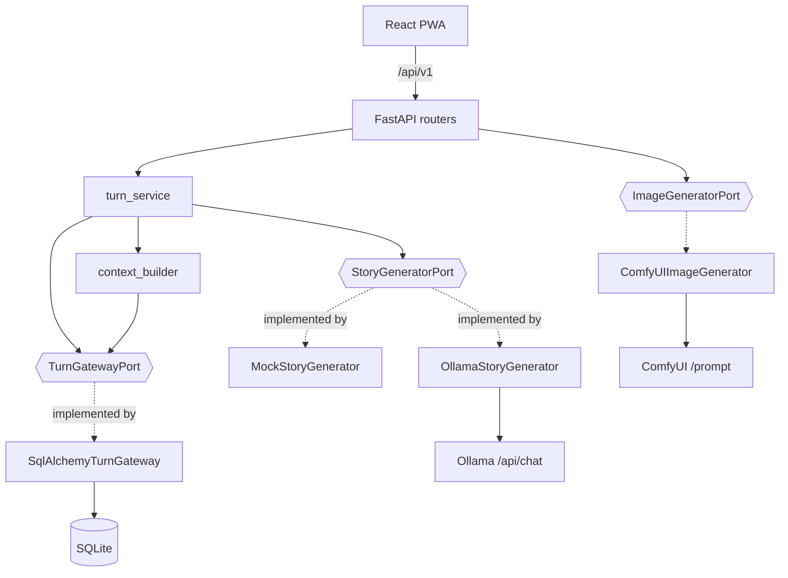
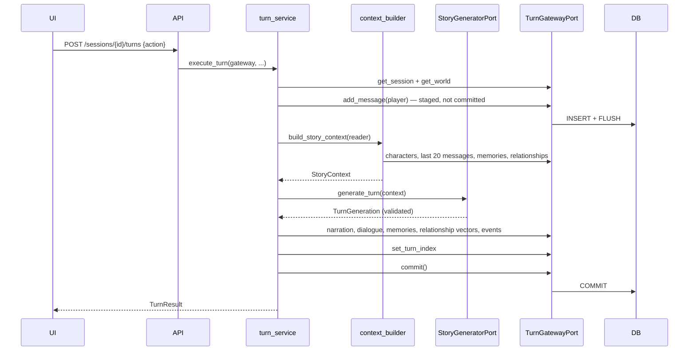

# Architecture

A pragmatic modular monolith. The layering resembles ports-and-adapters, but only where
that boundary earns its keep: external AI systems and the database.

## Modules

```text
apps/api/app/
├── domain/           pure Python: enums, relationship rules, errors. No I/O, no ORM.
│   ├── world_rules/      WorldRulesV1, its enums, presets, versioned parsing
│   ├── world_time/       the simulation clock, calendar projection, scheduling
│   ├── world_facts/      what is objectively true: values, properties, policy,
│   │                     authority, mutations, world-rules compatibility
│   ├── world_locations/  where things are: definitions, containment, connections,
│   │                     per-session state, creation policy
│   ├── world_situations/ what the world is doing: ongoing processes, their lifecycle,
│   │                     participants, causal parentage, progression arithmetic
│   ├── resolution/       how the world is allowed to change: commands, the context a
│   │                     resolver may see, outcomes, dispositions, event significance
│   ├── vocabulary.py     the shared shape rules for subtypes, tags and metadata bags
│   ├── state_mutations.py  the one batch that carries fact, spatial and situation changes
│   └── situation_progression.py  what one progression pass decided, before it is written
├── application/      use cases, the AI contract, ports. Depends on domain only.
│   ├── contracts.py      TurnGeneration and friends — what a model may return
│   ├── story_context.py  StoryContext — what a model is allowed to see
│   ├── ports.py          StoryGeneratorPort, ImageGeneratorPort (Protocols)
│   ├── persistence.py    read/write DTOs + the persistence ports
│   ├── context_builder.py  all retrieval policy, in one place
│   ├── rules_projection.py WorldRules → the compact AI-facing view
│   ├── turn_service.py   the turn use case
│   ├── resolution_service.py  the one path from a Command to a committed change
│   ├── resolvers.py      the registry: command kind → the resolver that calculates it
│   ├── event_service.py  significance policy, sequencing, append-only event writes
│   ├── narration_service.py  prose for an outcome that is already committed
│   ├── time_service.py   the only writer of the simulation clock
│   ├── state_service.py  the only writer of world facts and spatial state
│   ├── spatial_service.py  the spatial graph, materialisation, place creation
│   ├── spatial_context.py  deterministic, scene-sized geography for the prompt
│   ├── situation_service.py  starting, reading and progressing ongoing processes
│   ├── situation_context.py  deterministic, scene-sized relevance for the prompt
│   ├── fact_proposals.py reviewing what the Story Director claims is true
│   ├── location_proposals.py reviewing the places it says the story found
│   └── situation_proposals.py reviewing the processes it says began
├── infrastructure/   adapters: SQLAlchemy models, Ollama, ComfyUI, prompt loading
│   └── db/turn_gateway.py  SQLAlchemy implementation of the persistence ports
├── api/              HTTP adapter and composition: routers, DTOs, errors, DI
├── prompts/          version-controlled prompt files
└── scripts/          seed_demo
```

Dependencies point inwards: `api → application → domain`. `infrastructure` implements
the ports that `application` declares, and `api` is the HTTP adapter that composes the
two. Nothing in `domain` or `application` imports SQLAlchemy, FastAPI, `httpx`,
`app.infrastructure` or `app.api`; `domain` additionally does not import `application`.

That rule is **enforced, not just stated**. `tests/test_architecture.py` walks the AST of
every module under `app/domain` and `app/application` and fails on a forbidden import.
It exists because the rule was documented here while the turn service and context
builder were importing `sqlalchemy` and the ORM models directly — prose cannot fail a
build.



## Request lifecycle

1. FastAPI resolves `DbSession` — a request-scoped `AsyncSession`. For the turn
   endpoint it resolves `TurnGateway` instead, which binds `SqlAlchemyTurnGateway` to
   that same session. This is the only place the turn use case and the ORM meet.
2. The router validates the request into a DTO.
3. The router or an application service does the work.
4. **Write endpoints commit explicitly**, inside the handler or the use case.
5. The response is serialised from a DTO. ORM objects never cross the boundary.
6. Domain errors are mapped to a consistent envelope by `api/errors.py`.

Simple CRUD routers still query SQLAlchemy directly. That is deliberate: inventing a
repository per table to move `SELECT * FROM worlds` behind an interface would add
indirection without removing a dependency the API layer is allowed to have. Ports exist
where there is a use case to protect — currently the turn loop.

### Why commits are explicit

FastAPI closes `yield` dependencies *after* the response has been sent. Committing in
that teardown means a client which immediately re-reads can miss its own write — the
frontend refetches the transcript right after a turn, so this was a real race, not a
theoretical one. `get_db` therefore never commits; it only guarantees rollback on
failure. This is pinned by `test_turn_is_visible_to_an_immediate_reread`.

## Turn lifecycle



### Transaction strategy

**A turn is atomic.** Everything — including the player's own message — is written in
one transaction that commits only after the provider returns a valid `TurnGeneration`.

If generation fails, the whole transaction rolls back. The alternative (committing the
player message first) leaves a transcript ending in an unanswered action and a turn
counter that disagrees with the messages. A failed turn is a **no-op the player can
simply retry**, which is exactly what the UI tells them. Covered by
`test_failed_generation_rolls_back_the_entire_turn`.

The player's action is *staged* before generation — written and flushed, never
committed — so it appears in the transcript the provider reads. `TurnPersistencePort`
documents that requirement; the adapter satisfies it with a flush, and
`test_a_staged_message_is_readable_before_commit` pins both halves.

## Persistence ports

Every use case reaches storage through a Protocol in `application/persistence.py`, and
each one is exactly as wide as its job:

| Port | Responsibility |
|---|---|
| `StoryContextReaderPort` | the reads that feed context assembly |
| `TurnPersistencePort` | session/world lookups and every turn write |
| `TurnUnitOfWorkPort` | `commit()` |
| `SessionClockPort` | the simulation clock and its scheduled events |
| `SpatialPort` | reading and growing the spatial graph, and per-session state |
| `SituationPort` | reading and writing ongoing processes |
| `StateStorePort` | facts, space and situations together — what one batch may touch |
| `HistoryReaderPort` | reads over `game_events` |
| `EventWriterPort` | `HistoryReaderPort` plus `add_event` — append, and nothing else |
| `ResolutionReaderPort` | reads over `resolutions`, the mechanical trail |
| `ResolutionStorePort` | everything one resolution may touch, behind one transaction |
| `NarrationStorePort` | history, the resolution being narrated, and `commit()` |

`TurnGatewayPort` composes `StoryContextReaderPort`, `TurnPersistencePort` and
`ResolutionStorePort`. `build_story_context` takes only the reader — functions declare
the narrowest port they need — while `execute_turn` takes the composite, because one
transaction genuinely spans all three and splitting it into three arguments that must be
the same object helps nobody.

`EventWriterPort` has no update and no delete, in the Protocol and in the adapter. That
absence is the enforcement of event immutability: a caller cannot rewrite history through
a port that offers no verb for it. `NarrationStorePort` is narrow for the same reason in
the opposite direction — narration runs after the resolution's transaction has closed, so
it can read the verdict and write a message, and it cannot write a fact, an event, a
mutation or the clock. See [event-resolution.md](event-resolution.md).

`SessionClockPort` is deliberately outside that composite. A turn *reads* the clock and
never moves it, so `advance_time` gets a port that reaches the clock, the scheduled
events and the audit trail, and cannot touch the transcript or the relationships. The
same adapter satisfies it, since both use cases run in one request's transaction.

Limits (`RECENT_MESSAGE_LIMIT`, `MEMORY_LIMIT`, `CHARACTER_LIMIT`) stay in the
application: how much history is worth sending is policy, not storage. Ordering is
policy too, but it has to execute in the query to be worth anything, so each port
method's contract states the order the adapter must return, and the adapter honours it.

Read DTOs are separate from the `story_context` models on purpose. The adapter maps rows
into `TranscriptMessage`, `CharacterRecord` and friends; the application then decides
what becomes `StoryContext`. That is why speaker labels and relationship names are
resolved in `context_builder` rather than in SQL.

`tests/test_turn_ports.py` runs the whole turn against an in-memory fake gateway — if
the use case works with a dictionary, it does not depend on SQLAlchemy.
`tests/test_turn_gateway.py` checks the adapter against a real database.

## Persistence

SQLite via SQLAlchemy 2.x async + aiosqlite. Alembic owns the schema; there is no
`create_all` at startup, so a stale dev database surfaces as a warning instead of being
silently papered over.

- **UUID** primary keys (`sa.Uuid`).
- **Timestamps** always UTC. `UtcDateTime` is a `TypeDecorator` that rejects naive
  datetimes on write and returns timezone-aware UTC on read — SQLite has no native
  timezone support and would otherwise hand back naive values that break comparisons.
- **Pragmas** per connection: `foreign_keys=ON`, `journal_mode=WAL`,
  `synchronous=NORMAL`. Migrations are the one exception and run with `foreign_keys=OFF`:
  SQLite cannot alter a column in place, so Alembic's batch mode rebuilds the table by
  dropping it, and with enforcement on that DROP cascades away every child row. See
  [world-state-time.md](world-state-time.md#persistence).
- **Indexes** follow real access patterns: `(session_id, turn_index)` for transcripts,
  `(session_id, importance, created_at)` for memory retrieval.
- **Check constraints** enforce `importance BETWEEN 1 AND 5` and the `-100..100`
  relationship range at the database level, in addition to application clamping.
- **`worlds.rules_json`** stores a whole `WorldRulesV1` document in one JSON column
  rather than a table per section. It is static configuration with no independent
  lifecycle and no queries of its own, so relational decomposition would buy nothing and
  cost every read a join. It is never treated as an arbitrary dictionary: everything in
  and out goes through `parse_world_rules`, and a corrupt row fails loudly instead of
  defaulting. See [world-rules.md](world-rules.md#persistence).
- **`game_sessions.elapsed_minutes`** is the authoritative simulation clock, and the
  only stored temporal value: the date, the hour and the part of the day are projected
  from it on every read, so there is nothing that can disagree with it. `game_events`
  carry `occurred_at` alongside `turn_index` and an `event_sequence` that is unique per
  session, because everything in a turn usually shares a fictional minute and ordering
  needs a real tiebreak. See [world-state-time.md](world-state-time.md).
- **`world_facts`** holds one current value per subject and property, enforced by *two*
  partial unique indexes split on `subject_id IS NULL`. A single index would not
  constrain world-scoped facts at all, because SQL treats two NULLs as distinct — the
  invariant would hold for characters and silently fail for the world. `kind` is
  deliberately outside the key: including it would let one subject and property exist
  once as `world_truth` and once as `gameplay_flag` with opposite values.
  `source_event_id` is `ON DELETE SET NULL`, because provenance can decay and truth
  cannot. See [world-state-facts.md](world-state-facts.md).
- **`game_sessions.state_revision`** is a third counter alongside `turn_index` and
  `elapsed_minutes`, moving once per committed batch of state changes and never
  backwards. None of the three can be computed from another.
- **`worlds.initial_facts`** stores a world's starting facts as `SetFact` documents,
  copied into each new session and never written back to during play.
- **The five spatial tables** split along one line: `location_definitions`,
  `location_connections` and `location_zones` belong to the *world* and are shared by
  every save of it; `location_states` and `location_connection_states` belong to a
  *session* and are not. Ten sessions read one Broken Crown and each keeps its own answer
  to whether it is still standing. `origin_session_id` marks geography that gameplay
  invented inside one save, and visibility is "template, or mine" -- a disjunction no
  foreign key expresses, so every spatial query filters on it and the gateway is the only
  place that filter is written. Containment is one nullable self-referencing column with
  `ON DELETE SET NULL`, because losing a container must not delete what was inside it;
  the acyclicity no database can enforce lives in `world_locations.hierarchy`. See
  [world-state-locations.md](world-state-locations.md).
- **`resolutions`** is one row per verdict: the disposition, the resolver and its version,
  the revision before and after, and the idempotency key. `(session_id, idempotency_key)`
  is **unique in the database**, not checked in Python — two concurrent retries of one
  submission have to race and lose, and a check-then-insert would let both through.
  Narration is deliberately not stored here; `messages.resolution_id` points back instead,
  so regenerating a paragraph cannot disturb the mechanical audit trail.
- **`game_events`** is significant history, not a log: `subtype` is an open string,
  `category` is a closed enum because retrieval filters on it, and per-subtype policy
  decides what is persisted at all and clamps proposed importance into a band. There is no
  update path and no delete path anywhere — a correction is a new event pointing at the old
  one with `caused_by_event_id`. `resolution_id` groups the events one verdict produced;
  `(session_id, event_sequence)` is unique, which is what makes ordering total when a whole
  turn shares one fictional minute. See [event-resolution.md](event-resolution.md).

## AI provider boundaries

`StoryGeneratorPort` receives a `StoryContext` and returns a `TurnGeneration`. It gets
**no database session** — an adapter cannot reach into the database and quietly change
what "context" means. All retrieval policy lives in `context_builder.py`.

Provider selection is configuration-driven (`STORY_PROVIDER`, `IMAGE_PROVIDER`) and
resolved once at startup in `main.py`, stored on `app.state`. There is no global
mutable state.

**Failures are visible.** When `STORY_PROVIDER=ollama`, a broken Ollama produces a 502
naming the cause; it never falls back to the mock. Silent fallback would make a
misconfiguration look like a working game with disappointing prose.

## Design decisions

**Why SQLite.** One player, one machine, no concurrent writers. It needs no server, the
save file is a single file the user can copy, and WAL handles the read-heavy access
pattern. A network database would add operational cost for zero benefit here.

**Why no vector database yet.** Retrieval today is "most important, then most recent",
which is deterministic, debuggable, and adequate for the ~30 memories a young session
accumulates. Embeddings introduce a model dependency, an index to maintain, and
non-deterministic tests — before there is evidence that recency+importance is the
bottleneck. The seam is ready: `StoryContextReaderPort.load_memories` is one method with
one implementation, and swapping it changes nothing else. See
[ai-contract.md](ai-contract.md#future-semantic-retrieval).

**Why no microservices.** There is one user and one process. Splitting this into
services would add network hops, partial-failure modes, and deployment complexity to a
system whose hardest problem is prompt quality.

**Why prompts are files.** `app/prompts/*.md` are version-controlled and diffable, with
front-matter `version`. Prompt iteration is the main lever on output quality, and it
should show up in code review like any other change.
