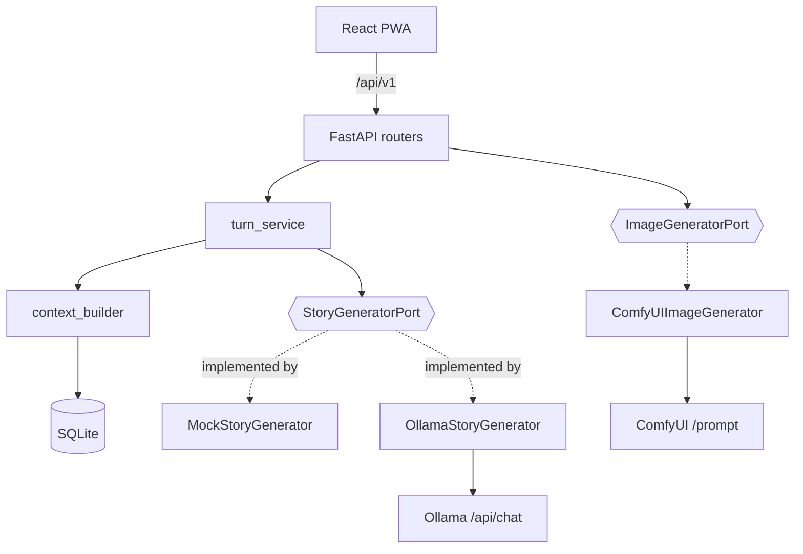
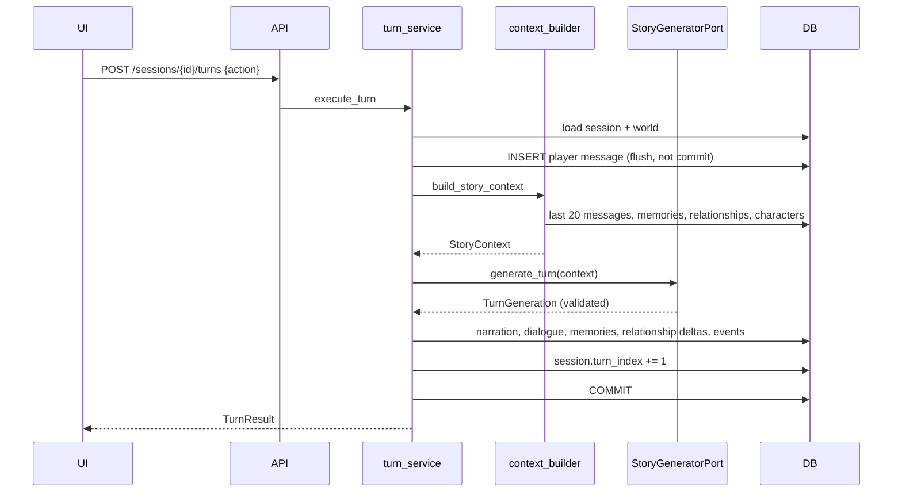

# Architecture

A pragmatic modular monolith. The layering resembles ports-and-adapters, but only where
that boundary earns its keep: external AI systems and the database.

## Modules

```text
apps/api/app/
├── domain/           pure Python: enums, relationship rules, errors. No I/O, no ORM.
├── application/      use cases, the AI contract, ports. Depends on domain only.
│   ├── contracts.py      TurnGeneration and friends — what a model may return
│   ├── story_context.py  StoryContext — what a model is allowed to see
│   ├── ports.py          StoryGeneratorPort, ImageGeneratorPort (Protocols)
│   ├── context_builder.py  all retrieval policy, in one place
│   └── turn_service.py   the turn use case
├── infrastructure/   adapters: SQLAlchemy models, Ollama, ComfyUI, prompt loading
├── api/              FastAPI routers, DTOs, error mapping, dependencies
├── prompts/          version-controlled prompt files
└── scripts/          seed_demo
```

Dependencies point inwards: `api → application → domain`. `infrastructure` implements
the ports that `application` declares. Nothing in `domain` or `application` imports
`httpx`, FastAPI, or SQLAlchemy models.



## Request lifecycle

1. FastAPI resolves `DbSession` — a request-scoped `AsyncSession`.
2. The router validates the request into a DTO.
3. The router or an application service does the work.
4. **Write endpoints commit explicitly**, inside the handler.
5. The response is serialised from a DTO. ORM objects never cross the boundary.
6. Domain errors are mapped to a consistent envelope by `api/errors.py`.

### Why commits are explicit

FastAPI closes `yield` dependencies *after* the response has been sent. Committing in
that teardown means a client which immediately re-reads can miss its own write — the
frontend refetches the transcript right after a turn, so this was a real race, not a
theoretical one. `get_db` therefore never commits; it only guarantees rollback on
failure. This is pinned by `test_turn_is_visible_to_an_immediate_reread`.

## Turn lifecycle



### Transaction strategy

**A turn is atomic.** Everything — including the player's own message — is written in
one transaction that commits only after the provider returns a valid `TurnGeneration`.

If generation fails, the whole transaction rolls back. The alternative (committing the
player message first) leaves a transcript ending in an unanswered action and a turn
counter that disagrees with the messages. A failed turn is a **no-op the player can
simply retry**, which is exactly what the UI tells them. Covered by
`test_failed_generation_rolls_back_the_entire_turn`.

## Persistence

SQLite via SQLAlchemy 2.x async + aiosqlite. Alembic owns the schema; there is no
`create_all` at startup, so a stale dev database surfaces as a warning instead of being
silently papered over.

- **UUID** primary keys (`sa.Uuid`).
- **Timestamps** always UTC. `UtcDateTime` is a `TypeDecorator` that rejects naive
  datetimes on write and returns timezone-aware UTC on read — SQLite has no native
  timezone support and would otherwise hand back naive values that break comparisons.
- **Pragmas** per connection: `foreign_keys=ON`, `journal_mode=WAL`,
  `synchronous=NORMAL`.
- **Indexes** follow real access patterns: `(session_id, turn_index)` for transcripts,
  `(session_id, importance, created_at)` for memory retrieval.
- **Check constraints** enforce `importance BETWEEN 1 AND 5` and the `-100..100`
  relationship range at the database level, in addition to application clamping.

## AI provider boundaries

`StoryGeneratorPort` receives a `StoryContext` and returns a `TurnGeneration`. It gets
**no database session** — an adapter cannot reach into the database and quietly change
what "context" means. All retrieval policy lives in `context_builder.py`.

Provider selection is configuration-driven (`STORY_PROVIDER`, `IMAGE_PROVIDER`) and
resolved once at startup in `main.py`, stored on `app.state`. There is no global
mutable state.

**Failures are visible.** When `STORY_PROVIDER=ollama`, a broken Ollama produces a 502
naming the cause; it never falls back to the mock. Silent fallback would make a
misconfiguration look like a working game with disappointing prose.

## Design decisions

**Why SQLite.** One player, one machine, no concurrent writers. It needs no server, the
save file is a single file the user can copy, and WAL handles the read-heavy access
pattern. A network database would add operational cost for zero benefit here.

**Why no vector database yet.** Retrieval today is "most important, then most recent",
which is deterministic, debuggable, and adequate for the ~30 memories a young session
accumulates. Embeddings introduce a model dependency, an index to maintain, and
non-deterministic tests — before there is evidence that recency+importance is the
bottleneck. The seam is ready: replace `context_builder._load_memories` and nothing
else changes. See [ai-contract.md](ai-contract.md#future-semantic-retrieval).

**Why no microservices.** There is one user and one process. Splitting this into
services would add network hops, partial-failure modes, and deployment complexity to a
system whose hardest problem is prompt quality.

**Why prompts are files.** `app/prompts/*.md` are version-controlled and diffable, with
front-matter `version`. Prompt iteration is the main lever on output quality, and it
should show up in code review like any other change.
